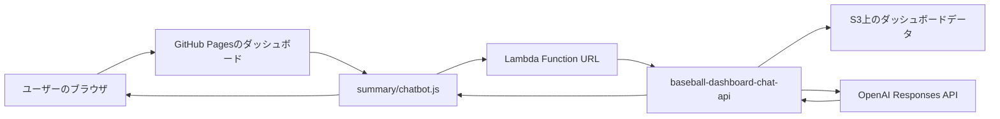

# AIチャットボット仕様書

## 概要

本仕様書は、野球ダッシュボードサイトに追加したAIチャットボット機能の構成、処理内容、データ参照範囲、運用手順をまとめたものです。

このチャットボットは、GitHub Pages上の静的ダッシュボードに表示されるフローティングUIです。ブラウザ側にはOpenAI APIキーを置かず、質問内容と画面情報をAWS Lambda Function URLへ送信します。LambdaはS3上のダッシュボードJSONを検索し、検索結果と表示中画面の情報をOpenAI Responses APIへ渡して、日本語の回答を生成します。

## 本番構成

| 項目 | 値 |
|---|---|
| フロントエンド配信 | GitHub Pages |
| 公開ダッシュボードURL | `https://heavy-tank-bs.github.io/baseball-dashboard/summary/index.html` |
| チャットAPI | AWS Lambda Function URL |
| Function URL | `https://2igxpnxlbz74ipsd46zkdo6dre0qykyq.lambda-url.ap-northeast-1.on.aws/` |
| Lambda関数名 | `baseball-dashboard-chat-api` |
| S3バケット | `baseball-dashboard-data-778685277894` |
| S3プレフィックス | `prod/` |
| AWSリージョン | `ap-northeast-1` |
| AWS CLIプロファイル | `baseball-dashboard` |
| 既定LLMモデル | `gpt-5-mini` |
| 既定最大出力トークン | `2500` |

## 全体アーキテクチャ



処理の流れは以下です。

1. ユーザーがダッシュボード上のAIチャットに質問する。
2. `summary/chatbot.js` が質問、会話履歴、現在表示中の画面情報を集める。
3. ブラウザがLambda Function URLへPOSTする。
4. LambdaがS3上の `summary` / `generated` JSONを検索する。
5. Lambdaが「画面情報 + 全データ検索結果 + 会話履歴 + 質問」をOpenAIへ渡す。
6. OpenAIの回答をLambdaがJSONで返す。
7. ブラウザ側のチャットUIに回答を表示する。

## 関連ファイル

| ファイル | 役割 |
|---|---|
| `summary/chatbot.js` | ブラウザ側のチャットUI。画面情報を収集し、チャットAPIへ送信する。 |
| `summary/styles.css` | `.ai-chatbot*` 系セレクタでチャットUIを装飾する。 |
| `summary/index.html` | 投手の試合別ページ。`chatbot.js` を読み込む。 |
| `summary/batter.html` | 野手の試合別ページ。`chatbot.js` を読み込む。 |
| `summary/annual.html` | 投手の年間ページ。`chatbot.js` を読み込む。 |
| `summary/annual-batter.html` | 野手の年間ページ。`chatbot.js` を読み込む。 |
| `summary/compare.html` | 比較ページ。`chatbot.js` を読み込む。 |
| `scripts/dashboard_chat_lambda.py` | AWS Lambda用のチャットAPI本体。S3検索とOpenAI呼び出しを行う。 |
| `scripts/dashboard_chat_server.py` | ローカル開発用サーバー。ローカルファイルと `.env` を使う。 |
| `scripts/build_github_pages.py` | GitHub Pages用の `site/` を生成する。 |
| `.github/workflows/deploy-pages.yml` | GitHub Pagesへの自動デプロイワークフロー。 |
| `.env` | ローカル専用の環境変数ファイル。Git管理しない。 |

## フロントエンド仕様

### 読み込み方法

各ダッシュボードHTMLでは、以下のようにチャットボットを読み込みます。

```html
<script defer src="./chatbot.js?v=20260523-lambda"></script>
```

`chatbot.js` はページ読み込み後に `document.body` へチャットUIを追加します。

### APIエンドポイントの決定順

`summary/chatbot.js` は、以下の優先順位で接続先APIを決定します。

1. `window.DASHBOARD_CHAT_ENDPOINT`
2. `<meta name="dashboard-chat-endpoint" content="...">`
3. `localhost` / `127.0.0.1` の場合は `/api/chat`
4. それ以外はAWS Lambda Function URL

このため、同じ静的ファイルを以下の環境で使い回せます。

- ローカル開発
- GitHub Pages
- 別のAPIサーバー
- AWS Lambda Function URL

### ブラウザ側の保存情報

チャットUIは `localStorage` に軽い状態を保存します。

| キー | 内容 |
|---|---|
| `npb-dashboard-chat-history` | 直近のチャット履歴 |
| `npb-dashboard-chat-open` | チャットパネルの開閉状態 |

現在の上限は以下です。

| 項目 | 上限 |
|---|---:|
| 保存する会話履歴 | `10` メッセージ |
| APIへ送る会話履歴 | 直近 `8` メッセージ |
| 画面コンテキスト | `6500` 文字 |
| ユーザー入力 | `600` 文字 |
| 回答表示用テキスト | `8000` 文字 |

### 画面情報の収集

質問送信時、ブラウザ側では現在表示中の画面から以下を集めます。

- ページタイトル
- 現在のパス
- 選択中のタブ
- アクティブなナビゲーション
- 入力欄、セレクトボックス、フィルターの値
- 選択中の結果カード
- 表示中iframeの選手成績テキスト
- メイン画面、年間テーブル、比較パネルなどの可視テキスト

この「表示中画面の情報」は回答材料の一部です。現在表示されていないデータについては、Lambda側がS3上の全データ検索結果を追加で渡します。

## API仕様

### チャット送信

本番環境では `POST /` を使用します。ローカル開発サーバーでは `POST /api/chat` を使用できます。

リクエスト例:

```json
{
  "message": "2026-05-23のオリックス野手で良かった選手を教えて",
  "history": [
    { "role": "user", "content": "..." },
    { "role": "assistant", "content": "..." }
  ],
  "context": "画面上から収集したダッシュボード情報",
  "page": {
    "title": "Dashboard title",
    "path": "/baseball-dashboard/summary/index.html"
  }
}
```

レスポンス例:

```json
{
  "reply": "回答本文"
}
```

エラーレスポンス例:

```json
{
  "error": "error message"
}
```

### 検索ヘルスチェック

エンドポイント:

```text
GET /api/search-health
```

2026-05-23データをS3同期した後の応答例:

```json
{
  "pitcherEntries": 2213,
  "batterEntries": 6034,
  "pitcherTotals": 649,
  "batterTotals": 609,
  "loadedSeconds": 3.239
}
```

各項目の意味:

| 項目 | 意味 |
|---|---|
| `pitcherEntries` | 試合別投手データ件数 |
| `batterEntries` | 試合別野手データ件数 |
| `pitcherTotals` | 年間投手成績件数 |
| `batterTotals` | 年間野手成績件数 |
| `loadedSeconds` | Lambdaが検索インデックスを読み込むのにかかった秒数 |

## Lambda仕様

### 役割

`scripts/dashboard_chat_lambda.py` は以下を担当します。

1. Lambda Function URLからのHTTPリクエストを解析する。
2. S3からダッシュボードJSONを読み込む。
3. Lambda内メモリに検索インデックスを作成する。
4. ユーザー質問に関連する投手・野手・チーム・日付・年を抽出する。
5. 関連する試合別データ、年間データを検索する。
6. 画面情報、検索結果、会話履歴、質問をまとめる。
7. OpenAI Responses APIへ問い合わせる。
8. 回答をJSONで返す。

### 環境変数

| 変数名 | 必須 | 既定値 | 用途 |
|---|---:|---|---|
| `OPENAI_API_KEY` | 必須 | なし | OpenAI API呼び出し用のAPIキー |
| `OPENAI_MODEL` | 任意 | `gpt-5-mini` | 使用するLLMモデル |
| `OPENAI_MAX_OUTPUT_TOKENS` | 任意 | `2500` | 最大出力トークン数 |
| `DATA_BUCKET` | 必須 | なし | ダッシュボードデータを格納したS3バケット |
| `DATA_PREFIX` | 任意 | `prod/` | S3キーのプレフィックス |
| `ALLOWED_ORIGIN` | 任意 | Function URL CORS側で管理 | 想定するGitHub PagesのOrigin |
| `DATA_CACHE_VERSION` | 任意 | なし | Lambdaの検索キャッシュ更新用のダミー値 |

注意:

- `OPENAI_API_KEY` は絶対にブラウザ側へ出さない。
- `OPENAI_API_KEY` をコマンド出力やログに表示しない。
- `.env` はローカル専用で、Gitへコミットしない。

### リクエスト制限

| 定数 | 値 | 用途 |
|---|---:|---|
| `MAX_REQUEST_BYTES` | `1_000_000` | APIリクエスト本文の最大サイズ |
| `MAX_SCREEN_CONTEXT_CHARS` | `6500` | 画面情報としてモデルへ渡す最大文字数 |
| `MAX_SEARCH_CONTEXT_CHARS` | `16000` | 全データ検索結果としてモデルへ渡す最大文字数 |

### Lambda内キャッシュ

Lambdaは `SEARCH_INDEX` をグローバル変数として保持します。

これにより、ウォーム状態のLambdaではS3を毎回読み直さず高速に回答できます。一方で、S3に新しいデータを同期しただけでは、既存のウォームLambdaが古い検索インデックスを持ち続ける可能性があります。

そのため、S3同期後は `DATA_CACHE_VERSION` を更新してLambda設定を再反映し、検索インデックスを読み直させます。

## 参照データ

LambdaはS3上の以下データを参照します。

| S3キー | 種別 | 用途 |
|---|---|---|
| `prod/summary/manifest.js` | JS代入形式のJSON | 試合別投手データ |
| `prod/summary/batter_manifest.js` | JS代入形式のJSON | 試合別野手データ |
| `prod/summary/player_totals.json` | JSON | 年間投手成績 |
| `prod/summary/batter_totals.json` | JSON | 年間野手成績 |
| `prod/generated/**/*.json` | JSON | 投手ダッシュボード詳細データ |

`manifest.js` と `batter_manifest.js` はJavaScript代入形式です。

```js
window.DASHBOARD_MANIFEST = { ... };
```

Lambdaでは代入部分を除去してJSONとして読み込みます。

## 全データ検索仕様

### 正規化

検索時は、質問文・選手名・チーム名などを比較しやすい形へ正規化します。

主な正規化:

- Unicode `NFKC` 正規化
- `casefold()` による小文字化
- 空白、句読点、記号の除去
- 選手名の部分一致
- チーム名の部分一致

これにより、全角・半角、空白あり・なしの差をある程度吸収します。

### 質問から抽出する要素

質問文から以下を検出します。

- 年
  - 例: `2026`
- 日付
  - 例: `2026-05-23`
- 投手名
- 野手名
- チーム名
- 投手系の質問かどうか
- 野手系の質問かどうか

投手・野手のどちらを聞いているか明確でない場合は、両方を検索します。

## 投手検索仕様

### 年間投手成績

投手の年間成績では、質問内容に応じて以下の指標で並び替えます。

| 質問意図 | 指標 | 並び順 |
|---|---|---|
| FIP | `fip` | 低い順 |
| WHIP | `whip` | 低い順 |
| ERA / 防御率 | `era` | 低い順 |
| K/9 / 奪三振 | `kPer9` | 高い順 |
| BB/9 / 四球 | `bbPer9` | 低い順 |
| 被打率 | `battingAverageAllowed` | 低い順 |
| 指標指定なし | `inningsOuts` | 高い順 |

### 試合別投手データ

試合別投手データでは、主に以下を回答材料にします。

- 日付
- チーム
- 選手
- 対戦カード
- 投球回
- 投球数
- 被安打
- 奪三振
- 四球
- 失点
- 自責点
- 球種割合
- 決め球
- 打球結果

「一番良かった」「ベスト」「好投」などの質問では、内部スコアで試合内容を評価します。

投手試合評価の概念:

```text
アウト数を高評価
奪三振を高評価
投球効率を高評価
四死球、被安打、失点を減点
```

## 野手検索仕様

### 年間野手成績

野手の年間成績では、質問内容に応じて以下の指標で並び替えます。

| 質問意図 | 指標 | 並び順 |
|---|---|---|
| 得点圏 | `scoringPositionBattingAverage` | 高い順 |
| wRC+ | `wrcPlus` | 高い順 |
| OPS | `ops` | 高い順 |
| HR / 本塁打 | `homeRuns` | 高い順 |
| 出塁率 | `onBasePercentage` | 高い順 |
| 長打率 | `sluggingPercentage` | 高い順 |
| 打率 / 安打 | `battingAverage` | 高い順 |
| 指標指定なし | `plateAppearances` | 高い順 |

### 試合別野手データ

試合別野手データでは、主に以下を回答材料にします。

- 日付
- チーム
- 選手
- 対戦カード
- 打数
- 安打
- 本塁打
- 打点
- 四球
- 三振
- 対戦した球種割合
- 打席結果

「一番良かった」「ベスト」「活躍」などの質問では、内部スコアで試合内容を評価します。

野手試合評価の概念:

```text
安打を高評価
本塁打を高評価
打点を高評価
四球をやや高評価
三振を減点
```

## OpenAI呼び出し仕様

LambdaはOpenAI Responses APIを呼び出します。

```text
POST https://api.openai.com/v1/responses
```

リクエストの主要項目:

```json
{
  "model": "gpt-5-mini",
  "instructions": "...",
  "input": "...",
  "max_output_tokens": 2500,
  "store": false
}
```

`input` は以下の順番で構成します。

1. 画面情報
2. S3全データ検索結果
3. 直近の会話履歴
4. 今回の質問

OpenAIへの主な指示:

- 日本語で回答する。
- 画面情報と全データ検索結果の両方を使う。
- 全データ検索に関連行がある場合、画面に表示されていなくてもそれを使う。
- 根拠のない選手成績、日付、チーム、球種、順位、結論を作らない。
- データが不足している場合は、何が不足しているかを伝える。
- 比較では短い箇条書きを優先する。

## S3同期仕様

チャットボットが全データ検索で参照できるのは、S3へ同期済みのJSONです。新しい試合データを作成した後は、以下をS3へ同期します。

対象:

- `summary/*.json`
- `summary/manifest.js`
- `summary/batter_manifest.js`
- `generated/**/*.json`

同期コマンド:

```powershell
$env:Path = [Environment]::GetEnvironmentVariable('Path','Machine') + ';' + [Environment]::GetEnvironmentVariable('Path','User')
$bucket = 'baseball-dashboard-data-778685277894'

aws s3 sync .\summary "s3://$bucket/prod/summary" `
  --exclude "*" `
  --include "*.json" `
  --include "manifest.js" `
  --include "batter_manifest.js" `
  --cache-control "no-cache" `
  --profile baseball-dashboard `
  --region ap-northeast-1

aws s3 sync .\generated "s3://$bucket/prod/generated" `
  --exclude "*" `
  --include "*.json" `
  --cache-control "no-cache" `
  --profile baseball-dashboard `
  --region ap-northeast-1
```

対象日がS3に入ったか確認する例:

```powershell
$targetDate = '2026-05-23'
$counts = aws s3api list-objects-v2 `
  --bucket $bucket `
  --prefix 'prod/generated/' `
  --query "length(Contents[?contains(Key, '$targetDate')])" `
  --output text `
  --profile baseball-dashboard `
  --region ap-northeast-1
($counts | Measure-Object -Sum).Sum
```

同期後はLambdaの検索キャッシュを更新します。具体的には、既存の環境変数を維持したまま `DATA_CACHE_VERSION` を新しい値に更新します。

確認コマンド:

```powershell
Invoke-RestMethod -Uri 'https://2igxpnxlbz74ipsd46zkdo6dre0qykyq.lambda-url.ap-northeast-1.on.aws/api/search-health' -Method Get | ConvertTo-Json -Depth 5
```

## GitHub Pagesデプロイ仕様

GitHub Pagesへの公開はGitHub Actionsで行います。

流れ:

1. `main` ブランチへpushする。
2. `.github/workflows/deploy-pages.yml` が起動する。
3. `scripts/build_github_pages.py` が `site/` を生成する。
4. `actions/upload-pages-artifact` が `site/` をアップロードする。
5. `actions/deploy-pages` がGitHub Pagesへ公開する。

GitHub Pagesに含める主なファイル:

- `summary/` 配下のHTML、CSS、JS、JSON、manifest
- `summary/chatbot.js`
- `generated/**/*.json`
- `generated/**/*.png`
- ルートリダイレクト用 `index.html`
- `.nojekyll`

重要:

GitHub Pagesは静的ホスティングです。OpenAI APIキーを安全に保持できないため、AI回答には別途AWS LambdaなどのAPIサーバーが必要です。

## ローカル開発仕様

ローカルでは `.env` と `scripts/dashboard_chat_server.py` を使います。

`.env` の例:

```env
OPENAI_API_KEY=sk-...
OPENAI_MODEL=gpt-5-mini
OPENAI_MAX_OUTPUT_TOKENS=2500
PORT=8787
```

起動:

```powershell
python scripts/dashboard_chat_server.py
```

ブラウザで開くURL:

```text
http://localhost:8787/
```

ヘルスチェック:

```text
http://localhost:8787/api/search-health
```

ローカルサーバーはS3ではなく、ローカルの `summary/` と `generated/` を直接読み込みます。

## セキュリティ仕様

- OpenAI APIキーはブラウザ側コードに含めない。
- `.env` はローカル専用でGit管理しない。
- Lambdaでは `OPENAI_API_KEY` を環境変数から読む。
- S3にはダッシュボード用JSONのみを置き、秘密情報は置かない。
- OpenAI API呼び出しでは `store: false` を指定する。
- CORSはLambda Function URL側の設定で管理する。
- Lambda設定更新時に環境変数全体を出力しない。
- コマンド出力やログにAPIキーを表示しない。

## 既知の制約

- 検索はキーワード・構造化データベース検索であり、ベクトル検索ではない。
- 短い選手名や似た名前では候補が曖昧になる可能性がある。
- S3へ同期しただけでは、ウォーム状態のLambdaが古い検索キャッシュを使う場合がある。
- 回答はストリーミングではなく、生成完了後にまとめて返す。
- GitHub Pages単体ではAIチャットボットを完結できない。
- 全データ検索の対象は、生成済みかつS3同期済みのデータのみ。

## 運用チェックリスト

新しい試合データを追加した後の手順:

1. 投手ダッシュボードを生成する。
2. 野手ダッシュボードを生成する。
3. `summary/build_manifest.py` を再実行して集計ファイルを更新する。
4. ローカルのダッシュボード表示を確認する。
5. `summary` のJSON・manifestと `generated` のJSONをS3へ同期する。
6. `DATA_CACHE_VERSION` を更新してLambdaの検索キャッシュを更新する。
7. `/api/search-health` で件数を確認する。
8. チャットボットに日付・チーム・選手を指定した質問を投げて確認する。
9. 静的サイト側の変更がある場合はGitHubへpushする。

